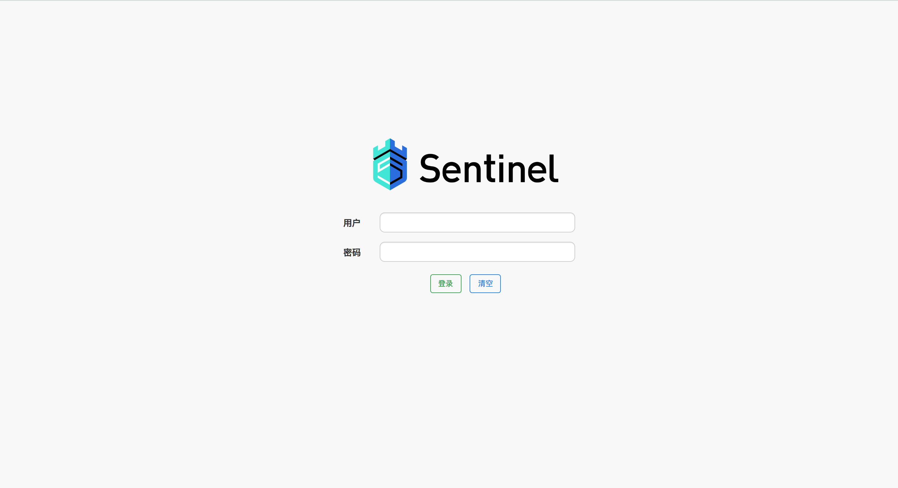
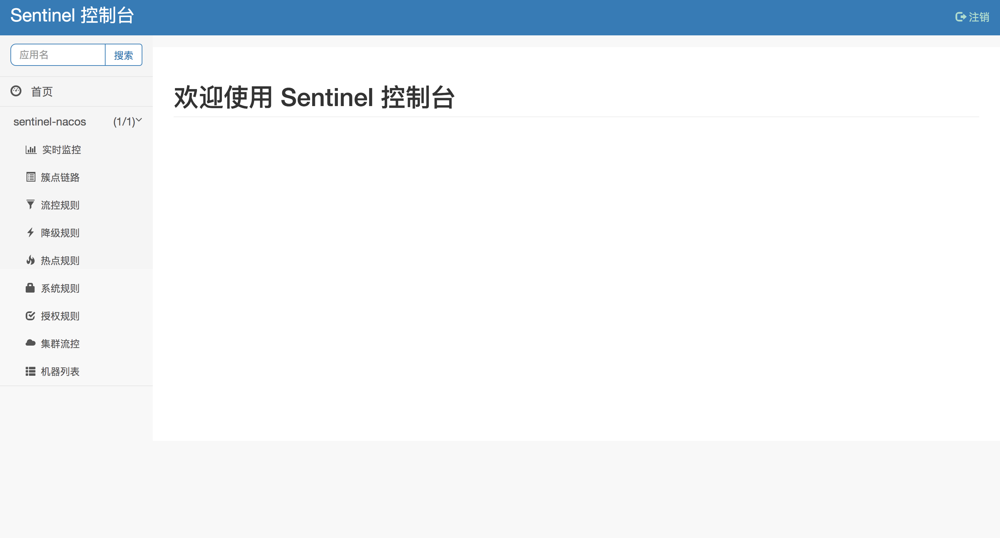
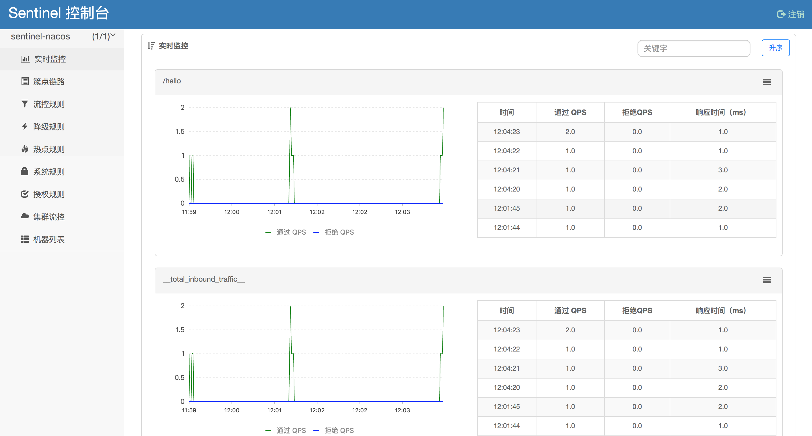
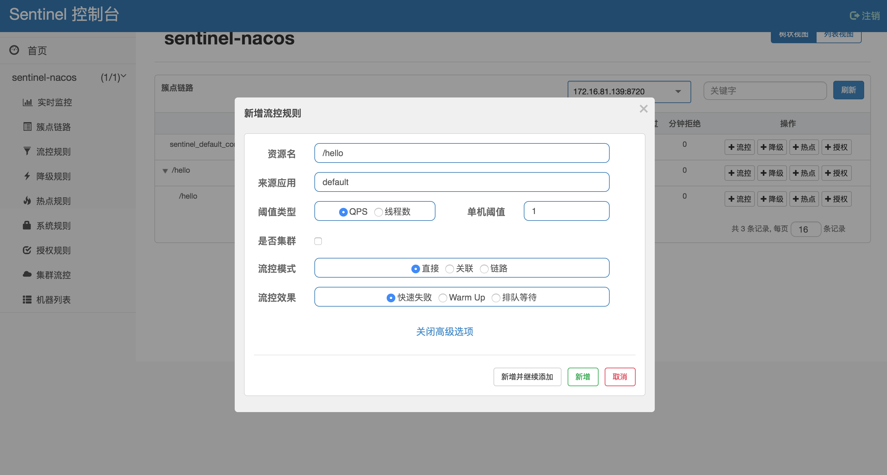
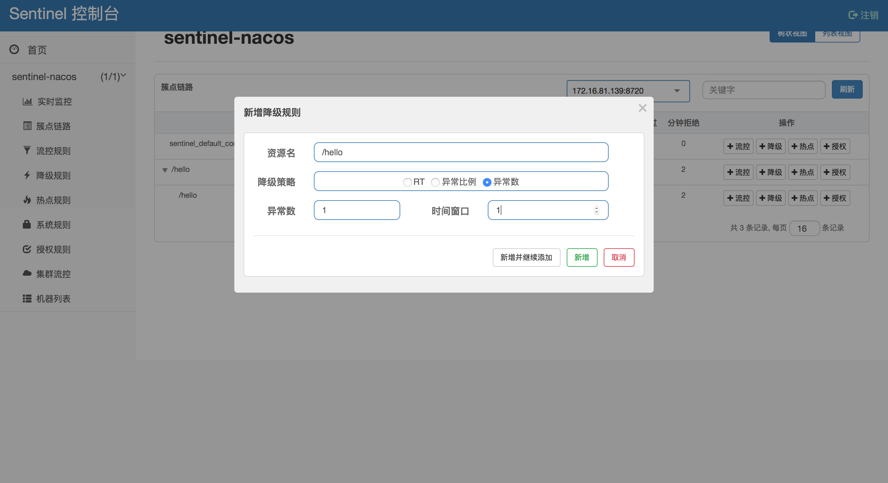
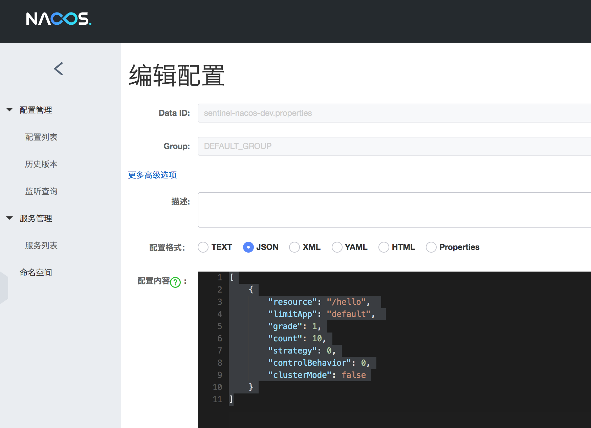
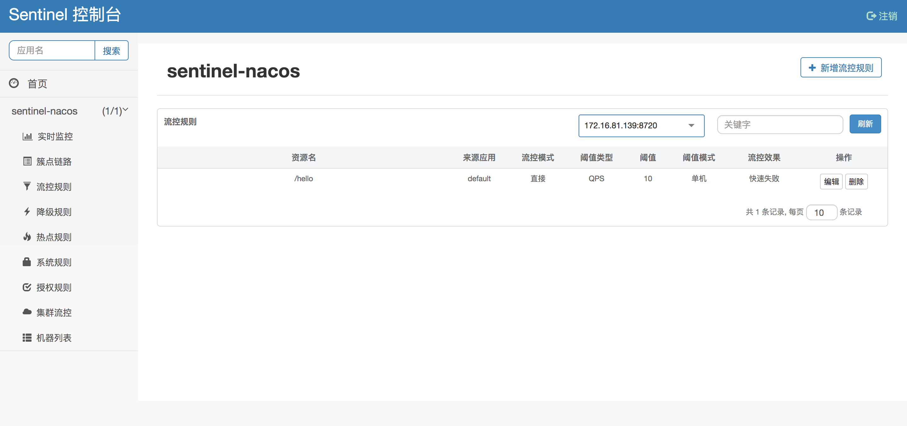
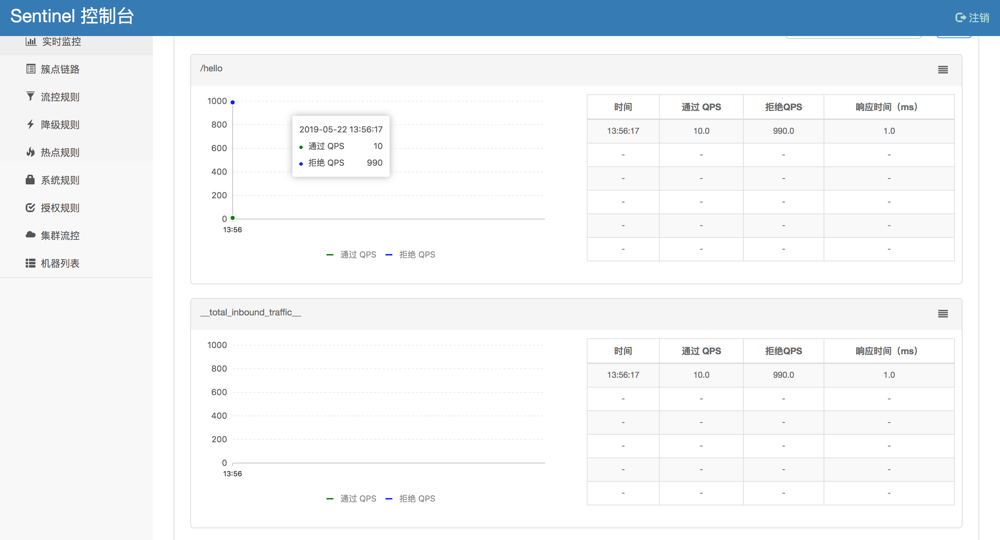
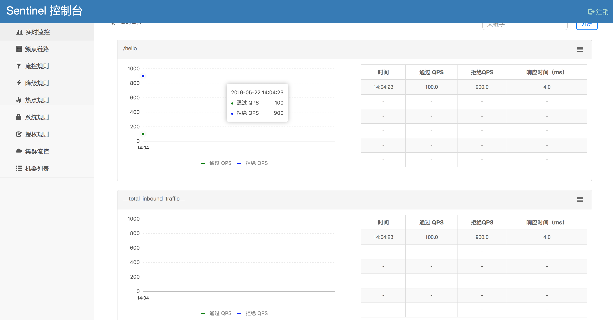

# Spring Cloud 使用 Sentinel 作为限流降级工具

## 启动 Dashboard

### 通过 jar 包启动

- [下载最新 Jar 包](https://github.com/alibaba/Sentinel/releases)

- 启动

因为 8080 端口有别的应用，所以从指定端口启动

```bash
java -jar sentinel-dashboard-1.6.0.jar --server.port=8088
```

### 访问

应用启动后，访问 [http://localhost:8088](http://localhost:8088)，即可看到 Sentinel 的 Dashboard

默认的用户名和密码都是 sentinel



## 配置应用

- 创建应用 

- 修改依赖 build.gradle 

```groovy
ext {
    springCloudVersion = 'Greenwich.SR1'
    springCloudAlibabaVersion = '0.2.2.RELEASE'
}

dependencyManagement {
    imports {
        mavenBom "org.springframework.cloud:spring-cloud-dependencies:${springCloudVersion}"
        mavenBom "org.springframework.cloud:spring-cloud-alibaba-dependencies:${springCloudAlibabaVersion}"
    }
}

dependencies {
    compile('org.springframework.cloud:spring-cloud-starter-alibaba-sentinel')
}

```

- 修改配置 application.properties

```properties
spring.application.name=sentinel-nacos
server.port=8084
```

- 添加接口

```java
@RestController
@RequestMapping("/")
public class BaseController {

    @GetMapping("/hello")
    @ResponseBody
    public String hello() {
        return "Hello World";
    }
}
``` 

### 测试

- 启动应用

启动后可以在 Sentinel 的 Dashboard 看到应用 



- 访问接口 

```bash
curl localhost:8084/hello
Hello World%
```

多次访问可以在实时监控中看到流量状态



#### 测试限流

- 添加限流规则

对接口`/hello`添加一条限流规则，只允许1s 内处理一个请求



快速多次访问，可以看到有请求被 Sentinel 拦截

```bash
curl localhost:8084/hello

Blocked by Sentinel (flow limiting)%
```

#### 测试降级

- 修改接口

```java
    @GetMapping("/hello")
    @ResponseBody
    public String hello() throws Exception {
        String s = null;
        s.toString();
        return "Hello World";
    }
```

- 添加降级规则

删除流控规则，并对接口`/hello`添加一条降级规则，当1s 内发生的异常超过 1 个时进行降级



- 测试 

第一次访问接口发生了异常，第二次访问的时候已经被限流

```bash
curl localhost:8084/hello

{"timestamp":"2019-05-22T04:21:23.496+0000","status":500,"error":"Internal Server Error","message":"No message available","path":"/hello"}%                                        

curl localhost:8084/hello

Blocked by Sentinel (flow limiting)%
```


## 使用 Nacos 作为配置中心

使用 Nacos 作为配置中心需要启动 Nacos 并添加相关的Namespace，具体可以参考 [Spring Cloud 使用 Nacos 作为配置中心](https://github.com/helloworlde/spring-cloud-alibaba-component/blob/master/cloud-config/README.md)

- 添加 Nacos 依赖

```groovy
ext {
    springCloudVersion = 'Greenwich.SR1'
    springCloudAlibabaVersion = '0.2.2.RELEASE'
}

dependencyManagement {
    imports {
        mavenBom "org.springframework.cloud:spring-cloud-dependencies:${springCloudVersion}"
        mavenBom "org.springframework.cloud:spring-cloud-alibaba-dependencies:${springCloudAlibabaVersion}"
    }
}

dependencies {
    compile('org.springframework.cloud:spring-cloud-starter-alibaba-nacos-config')
    compile('org.springframework.cloud:spring-cloud-starter-alibaba-sentinel')
    compile('com.alibaba.csp:sentinel-datasource-nacos:1.5.2')
}

```

### 修改配置

- bootstrap.properties

```properties
spring.application.name=sentinel-nacos
spring.cloud.nacos.config.server-addr=127.0.0.1:8848
spring.cloud.nacos.config.namespace=0f0b4247-a3df-499c-9808-1eea65956d2f
spring.cloud.nacos.config.group=DEFAULT_GROUP
spring.cloud.nacos.config.prefix=${spring.application.name}
spring.cloud.nacos.config.file-extension=properties
```

其中的 namespace 是新建的 Dev 的 Namespace 的 ID

- application.properties

```properties
spring.profiles.active=dev
server.port=8084
spring.cloud.sentinel.transport.dashboard=127.0.0.1:8088
spring.cloud.sentinel.datasource.ds.nacos.server-addr=127.0.0.1:8848
spring.cloud.sentinel.datasource.ds.nacos.data-id=${spring.application.name}-${spring.profiles.active}.properties
spring.cloud.sentinel.datasource.ds.nacos.group-id=DEFAULT_GROUP
spring.cloud.sentinel.datasource.ds.nacos.namespace=0f0b4247-a3df-499c-9808-1eea65956d2f
spring.cloud.sentinel.datasource.ds.nacos.rule-type=flow
```

其中的data-id 需要指定具体的配置的 data-id

- 添加 Nacos 限流配置



```json
[
    {
        "resource": "/hello", 
        "count": 10,   
        "grade": 1,             
        "limitApp": "default", 
        "strategy": 0,
        "controlBehavior": 0,
        "clusterMode": false
    }
]
```

- 其中的属性含义：
 - resource：资源名，即限流规则的作用对象
 - count: 限流阈值
 - grade: 限流阈值类型（QPS 或并发线程数）
 - limitApp: 流控针对的调用来源，若为 default 则不区分调用来源
 - strategy: 调用关系限流策略
controlBehavior: 流量控制效果（直接拒绝、Warm Up、匀速排队）
 - clusterMode：集群模式


具体可以参考 [流量控制#基于QPS/并发数的流量控制](https://github.com/alibaba/Sentinel/wiki/%E6%B5%81%E9%87%8F%E6%8E%A7%E5%88%B6#%E6%A6%82%E8%BF%B0)

### 测试

- 启动应用 

待启动完成后进行一次接口请求，就可以在 Sentinel Dashboard 看到应用；点击流控规则，可以看到我们在 Nacos 中添加的配置



- 请求接口

使用 [ab(Apache HTTP server benchmarking tool)](https://httpd.apache.org/docs/2.4/programs/ab.html) 进行接口请求

```bash
ab -n 1000 -c 100 localhost:8084/hello
```

完成后可以在 Sentinel Dashboard 看到限流的具体情况



- 修改限流规则

在 Nacos 中修改配置，修改阈值为 100

```json
[
    {
        "resource": "/hello", 
        "limitApp": "default", 
        "grade": 1,
        "count": 100,
        "strategy": 0,
        "controlBehavior": 0,
        "clusterMode": false
    }
]
```

修改后刷新Sentinel Dashboard，可以看到阈值已经变为 100，再次使用 ab 进行测试，可以看到通过的流量已经变成设置的阈值：

```bash
ab -n 1000 -c 100 localhost:8084/hello
```

